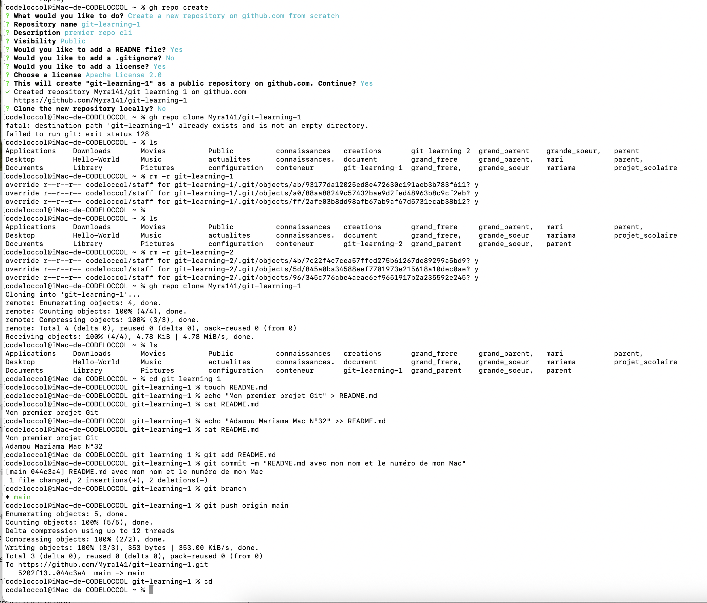

#Exercice:1
Créez un nouveau repo GitHub appelé git-learning-1.
Clonez le localement
Créez un fichier README.md with some text (exemple: "Mon premier projet Git")
Ajoutez une autre ligne au README.md (votre nom et le numéro de votre MAc), puis faites un commit, puis un push final
Sur GitHub, vérifier l'historique des commits

##Solution
**Etaper:1**
1:installation de homebrew avec ** /bin/bash -c "$(curl -fsSL https://raw.githubusercontent.com/Homebrew/install/HEAD/install.sh)"**
2:verification de l'instalon avec **brew --version**
3:installation de githup avec **brew install gh**
4:verfiaction avec **gh --version**
5:confiration de la terminal avec notre compte githup en utilisant **gh auth login**

**Etaper:2**
1: cree un repo git
    **gh repo create git-learning-1 --public**:Je utiliser cette commande pour creer un repo githup via terminal
    **git repo clone** permet de clone un repo git localement
2: entre dans le dossier git-learning-1 puis cree un fichier au nom de README.md en utilisant **touch**
3: Ajout d'une text dans le fichier avec **echo "text à ajouter" > nom du fichier** et verification avec   **cat puis nom du fichier**
3:Ajout d'une autre ligne de text dans le mm fichier avec **echo "text à ajouter" >> nom du fichier** comme ça le premier text ne sera pas effacer
5: Commit puuis le push avec
    **git add .**
    **git commit -m "ajout un text"**
    **git branch**permet de voir sur quel branch on a
    **git status**permet de voir notre status
    **git push -u origin "avec le nom de la branch**
6:Vrrification sur githup   

#voila une capture de l'exo1

