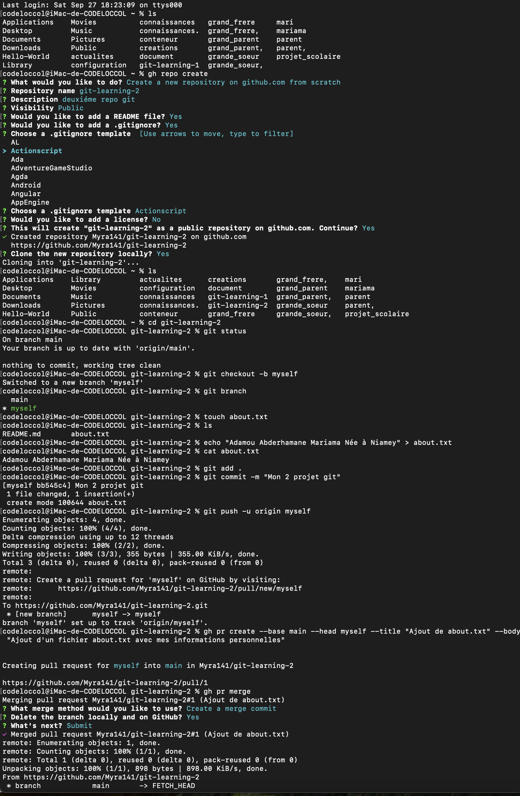
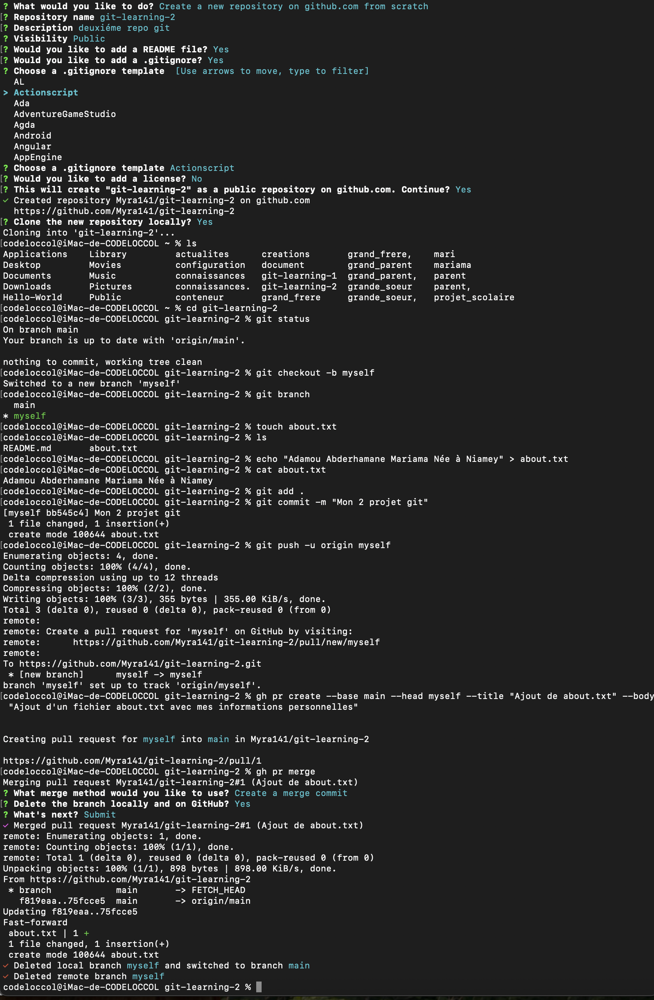

#Exercice:2
Notez que vous devrez surement installez Github CLI pour cet exercice.

Objectifs : Apprendre à créer des branches, y effectuer des changements et les merger dans la branche main

Depuis un repo clonez du nom: git-learning-2 que vous aurez créez créez une nouvelle branche du nom de myself.
Créez un fichier about.txt avec des infos sur vous (nom, prénom, lieu de naissance...)
Faites un commit puis, puis pushez la branche myself.
Faites un pull request de git-learning-2/myself -> main.
Mergez le pull request.
Sur GitHub, vérifier l'historique.

##Solution
**Etaper**
1: cree un repo git
    **gh repo create git-learning-2 --public**:Je utiliser cette commande pour creer un repo githup via terminal
    **git repo clone** permet de clone un repo git localement
2:Enter dans git-learning-2
3:Creation d'une nouvelle branche 
    **git checkput -b myself** permet de creer une nouvelle branche et se bascule en mm temps sur la branche
4:creation d'une fichier about.txt avec **touch** puis ajout du text à l'interieur avec
    **echo "text à ajout" > nom du fichier**
5:Faire un commit puis pushez la branche myself avec
    **git add .**
    **git commit -m "ajout un text"**
    **git push -u origin myself**
6:un pull request de git-learning-2/myself -> main.
    **gr pr create --bade main --head myself --title "ajout de text" --body "ajout d'un fichier avec ses info** elle permet de pendre le contenue d'un fichier local à un fichier distant et d'un fichier distant à un fichier local
7:Merger un pull request  
    **gh pr merge** permet de fusionner une branche dans un autre
8:verfication dans githup

#voila une capture de l'exo2

