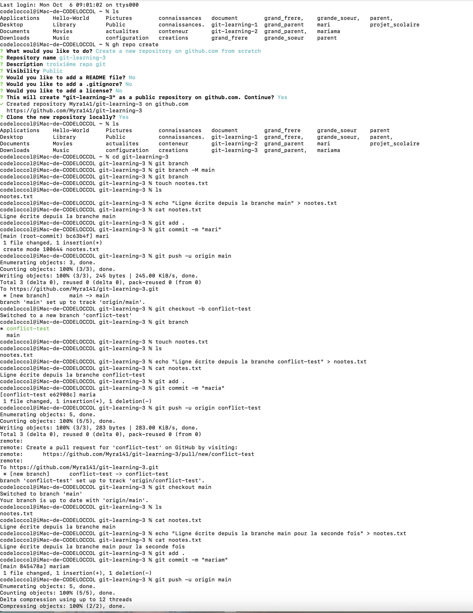
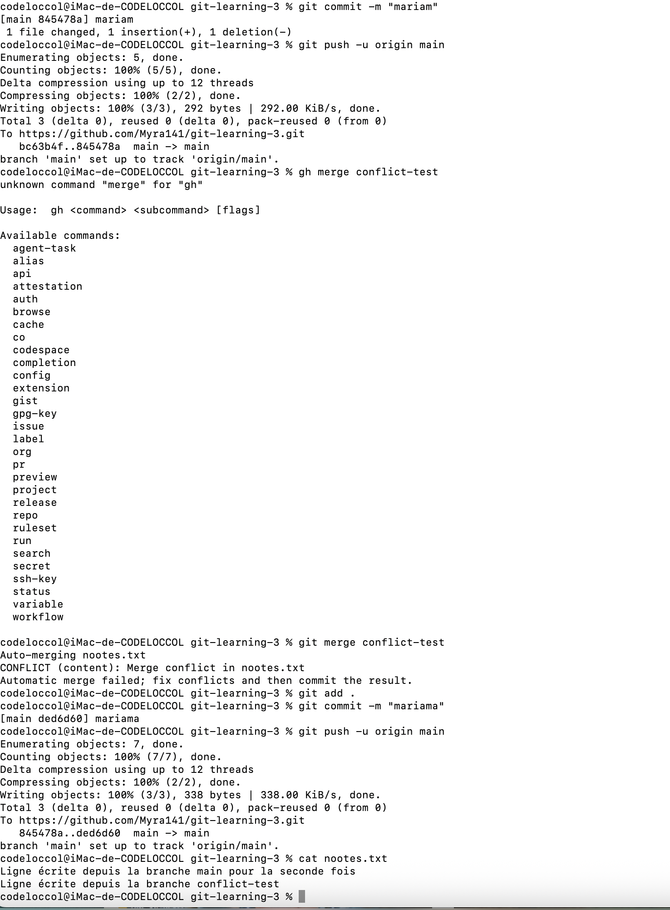

#Exercice3
Créez un nouveau repo GitHub appelé git-learning-3.
Sur la branche main, ajoutez un nouveau fichier notes.txt avec pour contenu "Ligne écrite depuis la branche main".
Faites un commit et pushez.
Créez une branche conflict-test
Editez note.txt depuis la branche conflict-test et insérez y la phrase "Ligne écrite depuis la branche conflict-test".
Faites un commit et pushez.
Revenez à la branche main et remodifiez notes.txt différemment avec la phrase "Ligne écrite depuis la branche main pour la seconde fois".
Faites un commit et pushez.
Essayez de merger la branche conflict-test dans main.
Vous obtiendrez une erreur.

Ouvrez notes.txt depuis votre éditeur de code, et résolvez le conflit manuellement (décidez de gardez les deux lignes).
Vérifiez la version finale sur Github en ouvrant note.txt.

##Solution
**Etaper**
1: cree un repo git
    **gh repo create git-learning-2 --public**:Je utiliser cette commande pour creer un repo githup via terminal
    **git repo clone** permet de clone un repo git localement
2:Enter dans git-learning-2
3:Dans main cree un fichier notes.txt avec **touch** puis ajout du text à l'interieur avec
    **echo "text à ajout" > nom du fichier**
4:Faire un commit puis pushez la branche main avec
    **git add .**
    **git commit -m "ajout un text"**
    **git push -u origin main** 
5:creation d'une nouvelle branche conflict-test      
    **git checkput -b conflict-test** permet de creer une nouvelle branche et se bascule en mm temps sur la branche
6:creation d'une fichier notes.txt avec **touch** puis ajout du text à l'interieur avec
    **echo "text à ajout" > nom du fichier** 
7:Faire un commit puis pushez la branche myself avec
    **git add .**
    **git commit -m "ajout un text"**
    **git push -u origin myself**   
8:Revenir à la branche main avec **git checkout main**
9:Dans main cree un fichier notes.txt avec **touch** puis ajout du text à l'interieur avec
    **echo "text à ajout" > nom du fichier**
10:Faire un commit puis pushez la branche main avec
    **git add .**
    **git commit -m "ajout un text"**
    **git push -u origin main** 
11:Merger la branche conflict-test dans main avec **gh merge conflict-test**
12:Ouvrir notes.txt depuis mon éditeur de code et résoudre le conflit manuellement
13:Verification sur githup

#voila une capture de l'exo3

